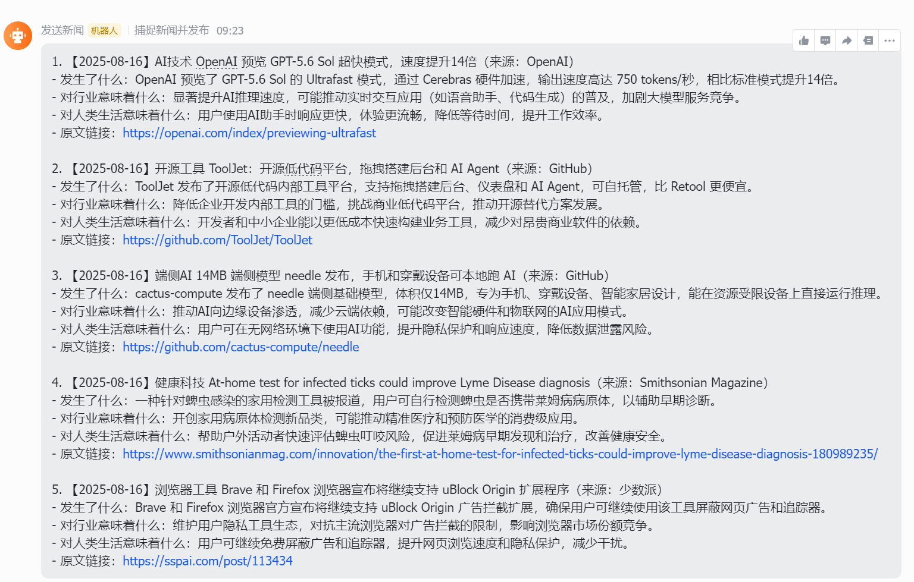
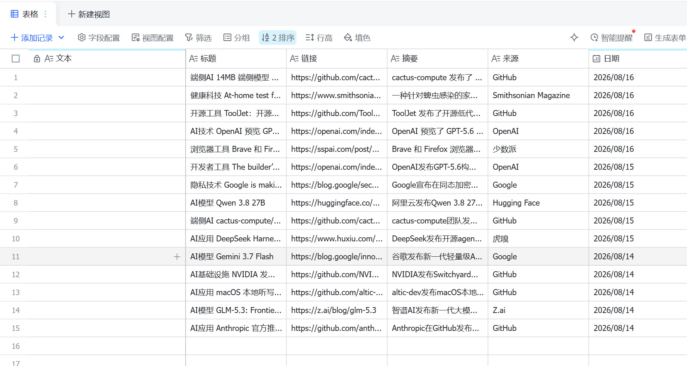

# AI 新闻日报自动化工作流

> 每天定时抓取 AI/科技新闻 → DeepSeek 分析 → 飞书群推送 → 多维表格存档

## 功能

- ⏰ 定时触发（可自定义时间）
- 📡 4 个 RSS 源并行抓取
- 🤖 DeepSeek AI 智能筛选与分类
- 📊 自动分析行业影响与生活应用
- 📱 飞书群消息推送（带日期、分类、分析、原文链接）
- 💾 飞书多维表格自动存档
- 🔄 动态 token 获取，无需手动刷新

## 技术栈

- n8n（自动化编排）
- DeepSeek API（AI 筛选与分析）
- 飞书机器人（消息推送）
- 飞书多维表格（数据存档）
- RSS（新闻源聚合协议）

## 使用方法

### 1. 导入工作流

1. 打开 n8n 界面（默认地址 `http://localhost:5678`）
2. 点击右上角“Import from File”
3. 选择本仓库中的 `n8n-ai-news-automation.json` 文件

### 2. 替换占位符

导入后，需要替换以下占位符：

| 占位符 | 说明 | 获取位置 |
|--------|------|----------|
| `YOUR_APP_ID` | 飞书应用 ID | 飞书开发者后台 → 应用凭证 |
| `YOUR_APP_SECRET` | 飞书应用密钥 | 飞书开发者后台 → 应用凭证 |
| `YOUR_FEISHU_WEBHOOK` | 飞书机器人 Webhook | 飞书群 → 群机器人 → 自定义机器人 |
| `YOUR_APP_TOKEN` | 多维表格 app_token | 表格链接中 `base/` 后面的那串 |
| `YOUR_TABLE_ID` | 多维表格 table_id | 表格链接中 `table=` 后面的那串 |
| `YOUR_DEEPSEEK_API_KEY` | DeepSeek API Key | DeepSeek 平台 → API Keys |

### 3. 配置 RSS 源

在 `RSS Read` 节点中替换为你想要的 RSS 地址，推荐：

- 量子位：`https://www.qbitai.com/feed`
- 机器之心：`https://www.jiqizhixin.com/rss`
- 36氪：`https://36kr.com/feed`
- 爱范儿：`https://www.ifanr.com/feed`

### 4. 激活工作流

点击右上角 **Active** 开关，工作流将在设定时间自动运行。

## 效果展示

### 飞书群消息

### 多维表格存档

## 更新日志

### 2026-08-14

- 新增飞书多维表格自动存档功能
- 使用动态 token 获取方式，无需手动刷新
- 支持 4 个 RSS 源并行抓取，汇总后 AI 二次筛选
- 修复 JSON 解析错误
- 修复顺序偏见问题

## 安全说明

导出的 JSON 文件中，敏感信息已全部替换为占位符。使用时请替换为实际值。

## 许可证

MIT License © 2026 [vine20071112]

## 作者

- GitHub:https://github.com/vine20071112
